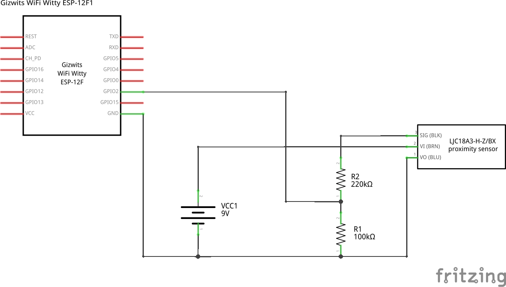
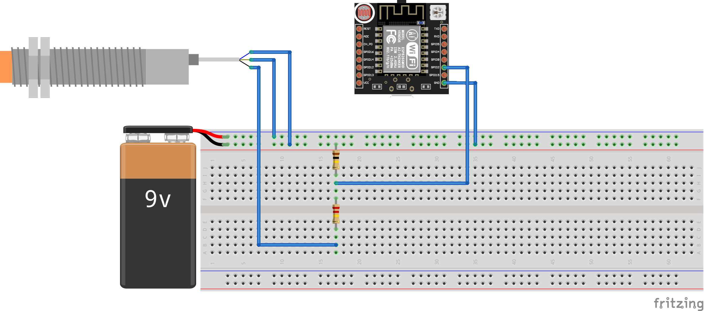

# MTCProximitySensor
MTConnect adapter for inductive proximity sensor LJ12A3-4-Z/BY

# Usage
Connect the LJ12A3-4-Z/BY proximity sensor to your ESP8266.




Important note: make sure the output of the voltage divider (the one connected to pin GPIO2 on the schematics) provides in all situation a voltage lower than 3.3V.

1. Adjust the pin to which you connected your sensor on the ESP8266 in the code. For this, 
   adjust the following [code](arduino/MTCProxySensor/MTCProxySensor.ino) line as needed:
   ```
   #define TRIGGERPIN 4
   ```

2. You can as well adjust the time the sensor waits to re-arm the trigger after having been released with the [code](arduino/MTCProxySensor/MTCProxySensor.ino) line:
   ```
   #define DEAD_TIME 2000
   ```
   The time is defined in milliseconds.

3. Compile and upload the code to your ESP8266 using the Arduino IDE.
   In order the ESP8266 can connect to your WiFi network add a file
   `secret.h` in the [Arduino project folder](arduino/MTCDHT) with the following content:
   ```
   #define SECRET_SSID "your Wifi ssid"
   #define SECRET_PASS "your Wifi password"
   ```

4. Once running, check if SHDR messages are emitted by the adapter by running in a terminal:
   ```
   telnet IP_ADRESS 7878
   ```
   where `IP_ADRESS` is the IP address of your ESP8266 running the adapter. 
   The IP address can be found on the serial monitor attached to your ESP8266.
